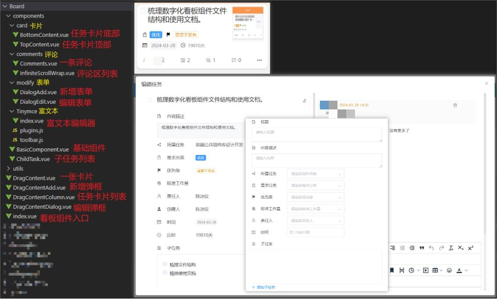
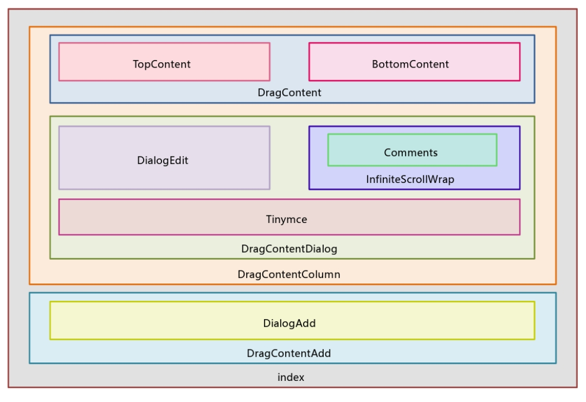

# 任务看板

## 目录结构

 

## 各组件之间的嵌套关系




## 使用说明

了解各个组件之间的嵌套关系对于有效地使用组件并正确绑定参数和方法至关重要。明白了它们的嵌套关系后，我们能够更清晰地确定什么样的参数和方法需要绑定在谁的身上。

组件的对外接口主要包括属性、方法和插槽，它们定义了组件与外部世界交互的方式，使得组件可以被其他组件或系统所调用和使用。因此，我们需要知道各个组件里面都提供了哪些对外的接口。

## 看板组件入口

入口文件为： `index.vue`

### **Attributes**

| 参数        | 配置用途       | 类型   |
| ----------- | -------------- | ------ |
| columnItems | 状态列表配置项 | Array  |
| columnData  | 状态列表数据   | Object |

### **Slot**

| 名称                 | 说明             |
| -------------------- | ---------------- |
| DragContentDialogAdd | 新增弹窗内容插槽 |
| DragContentMsgTop    | 卡片信息内容插槽 |
| DragContentDialogMsg | 编辑弹窗内容插槽 |

### **数据结构**

```js
// 状态列表配置项
columnItems(){
  return[
    {
      props:'pending',// 数据对应的key
      headerText: '待领取',// 列头部标题内容
      headerWidth:  '32%',// 列头部标题宽度
      bgColor:  '#4A9FF9',// 列头部标题背景颜色
    },
    {
      props:'doing',
      headerText: '进行中', 
      headerWidth:  '32%', 
      bgColor:  '#f9944a', 
    },
    {
      props:'finish',
      headerText: '已完成', 
      headerWidth:  '32%',
      bgColor:  '#2ac06d', 
    },
  ]
}
// 状态列表数据
columnData:{
  pending: [{...}],
  doing: [{...},{...}],
  finish: [{...},{...}]
}, 
// 注意：columnItems中所配置到的props，必须与columnData中的key一一对应。  
```


## **任务卡片列表**

文件入口：`DragContentColumn.vue`

### **Attributes**

| 参数        | 配置用途           | 类型   |
| ----------- | ------------------ | ------ |
| headerText  | 列头部标题内容     | String |
| headerWidth | 列头部标题宽度     | String |
| bgColor     | 列头部标题背景颜色 | String |
| list        | 每一列的数据       | Array  |
| columnKey   | 列key              | Number |

### **Events**

| 事件名      | 说明                       | 传递参数 |
| ----------- | -------------------------- | -------- |
| change      | 修改任务卡片所属拖拽列     | params   |
| showContent | 打开编辑弹窗，展示任务信息 | element  |

## 卡片

文件入口：`DragContent.vue`

### **Attributes**

| 参数    | 配置用途 | 类型   |
| ------- | -------- | ------ |
| element | 卡片信息 | Object |

### **Events**

| 事件名      | 说明                   | 传递参数 |
| ----------- | ---------------------- | -------- |
| changeCheck | 更改任务卡片的勾选状态 | element  |

## 任务卡片上部

文件：`TopContent.vue`

### **Attributes**

| 参数         | 配置用途             | 类型    |
| ------------ | -------------------- | ------- |
| contentItems | 卡片上部信息配置项   | Array   |
| element      | 卡片上部内容数据     | Object  |
| showNumber   | 是否显示头部编号(id) | Boolean |

> 内含自定义插槽，可在contentItems中，通过给某些item配置slotName来预留具名插槽位置，`<slot v-if="item.slotName" :name="item.slotName"/>`之后在使用到改组件的地方，用相同的名字插入自定义内容。`<template slot="配置过的slotName"> ……</template>`

### **数据结构**

```js
// 卡片上部信息配置项
contentItems(){ 
  return [
    [// 有插槽时props可配可不配
      {label:'分类',props: '',icon:'el-icon-price-tag',slotName:'type-slot'},
      {label:'优先级',props: '',icon:'el-icon-s-flag',slotName:'priority-slot'}
    ],
    [
      {label:'时间',props:'',icon:'el-icon-date',slotName:'time-slot'},
      {label:'历时',props:'',icon:'el-icon-time',slotName:'duration-slot'}
    ],
  ]
},
// 卡片上部内容数据
element: {
  type: 1,
  priority: 2,
  plan_time: "2024-02-09",
  duration: "19天"
}
// 注意：contentItems中所配置到的props(如有配)，必须与element中的key一一对应。
```


## 任务卡片下部

文件：`BottomContent.vue`

### **Attributes**

| 参数             | 配置用途               | 类型   |
| ---------------- | ---------------------- | ------ |
| statisticItems   | 卡片下部统计列表配置项 | Array  |
| messages         | 卡片下部统计列表数据   | Object |
| statisticButtons | 卡片右下角按钮配置项   | Array  |

### **Events**

| 事件名         | 说明                       | 传递参数 |
| -------------- | -------------------------- | -------- |
| handleButClick | 点击调用按钮配置的相应事件 | element  |

> 点击按钮时，使用$emit通知父组件调用相应方法，并传递将此任务卡片的信息。  
>
> 点击调用的方法: `handleButClick(event,element){   this.$emit(event,element)  },`
>
> **注意**：
>
> * `statisticButtons` 中所配置的事件名称 event 必须与 methods 中声明的方法名一致，并且记得在父组件中，对使用的index组件进行事件绑定。

### **数据结构**

```js
/ 卡片下部统计列表配置项
statisticItems(){
  return [
    {icon:'el-icon-user',props:'responsible_name'},
    {icon:'el-icon-set-up',props:'subtask_num'},
    {icon:'el-icon-connection',props:'attachment_num'},
    {icon:'el-icon-chat-line-square',props:'comment_num'}
  ]
},
// 卡片下部统计列表数据
messages: {
  responsible_name: '小陈',
  subtask_num: 5,
  attachment_num: 6,
  comment_num: 8,
}
// 注意：statisticItems中所配置到的props，必须与messages中的key一一对应。
// 卡片右下角按钮配置项
statisticButtons(){
  return [
    {icon:'el-icon-document-copy',title:'复制任务',event:'digitalTaskCopy'},
{icon:'el-icon-delete',title:'删除任务',event:'digitalTaskDelete'},
{icon:'el-icon-s-check',title:'提交工时单',event:'openApplyDialog'},
  ]
},
```


## **新增弹窗**

文件： `DragContentAdd.vue`

### **Attributes**

| 参数           | 配置用途     | 类型    |
| -------------- | ------------ | ------- |
| addVisible     | 弹窗是否可见 | Boolean |
| dialogTitleAdd | 弹窗标题     | String  |

## **新增表单**

文件：`DialogAdd.vue`

### **Attributes**

| 参数           | 配置用途       | 类型   |
| -------------- | -------------- | ------ |
| dialogAddItems | 新增表单配置项 | Array  |
| addFormData    | 新增表单数据   | Object |

> 内含自定义插槽，可在contentItems中，通过给某些item配置slotName来预留具名插槽位置，`<slot v-if="item.slotName" :name="item.slotName"/>`之后在使用到改组件的地方，用相同的名字插入自定义内容。`<template slot="配置过的slotName"> ……</template>`

### **Events**

| 事件名    | 说明     | 传递参数    |
| --------- | -------- | ----------- |
| submitAdd | 提交新增 | addFormData |
| closeAdd  | 取消新增 | 无          |

### **数据结构**

```js
/ 新增表单配置项
dialogAddItems (){ 
  return [
    [
      {
        label:'标题',
        props:'title',
        icon:'el-icon-document-checked',
        slotName:'title-slot',
        noShow: true,
      },
    ],
    [
      {
        label:'内容描述',
        props:'content',
        icon:'el-icon-document',
        slotName:'content-slot',
      },
    ],
    [
      {
        label:'所属任务',
        props:'project_id',
        icon:'el-icon-share',
        slotName:'project-slot',
        options:{
          comp: 'el-select', // 组件
          attr: {
            placeholder:'请选择项目名称',
          },
          children: this.digitalOptions.project_id ? 
          this.digitalOptions.project_id.map((item) => {
            return {
              comp: "el-option",
              data: item.value,
              attr: {
                label: item.label,
                value: item.value,  
                key: item.key,    
              },
            };
          })
          :[]
        },
      }
    ],
    [
      {
        label:'需求分类',
        props:'type',
        icon:'el-icon-price-tag',
        slotName:'type-slot',
        options:{
          comp: 'el-select', // 组件
          attr:{
            placeholder:'请选择需求分类',
          },
          children: this.digitalOptions.type ? 
          this.digitalOptions.type.map((item) => {
            return {
              comp: "el-option",
              data: item.value,
              attr: {
                label: item.label,
                value: item.value,  
                key: item.key,    
              },
            };
          })
          :[]
        }
      }
    ],
    [
      {
        label:'优先级',
        props:'priority',
        icon:'el-icon-s-flag',
        slotName:'priority-slot',
        options:{
          comp: 'el-select', // 组件
          attr:{
            placeholder:'请选择优先级',
          },
          children: this.priorityList.map((item) => {
            return {
              comp: "el-option",
              data: item.value,
              attr: {
                label: item.label,
                value: item.value,  
                key: item.key,    
              },
            };
          })
        },
      }
    ],
    [
      {
        label:'标准工作量',
        props:'work_level',
        icon:'el-icon-guide',
        slotName:'work-slot',
        options:{
          comp: 'el-select', // 组件
          attr:{
            placeholder:'请选择标准工作量',
          },
          children: this.digitalOptions.work_level ? 
          this.digitalOptions.work_level.map((item) => {
            return {
              comp: "el-option",
              data: item.value,
              attr: {
                label: item.label +"："+ item.hours + "h",
                value: item.value,  
                key: item.key,    
              },
            };
          })
          :[],
        }
      }
    ],
    [
      {
        label:'责任人',
        props:'responsible_uid',
        icon:'el-icon-user',
        slotName:'responsible-slot',
        options:{
          comp: 'el-select', // 组件
          attr:{
            placeholder:'请选择责任人',
          },
          children: this.digitalOptions.responsible_uid ? 
          this.digitalOptions.responsible_uid.map((item) => {
            return {
              comp: "el-option",
              data: item.value,
              attr: {
                label: item.label,
                value: item.value,  
                key: item.key,    
              },
            };
          })
          :[]
        }
      }
    ],
    [
      {
        label:'创建人',
        props:'create_name',
        icon:'el-icon-user-solid',
        noChange: true,
        options:{
          comp: 'el-select', // 组件
          attr:{
            placeholder:'请选择创建人',
            disabled:this.editVisible ? true : false, 
          },
          children: this.digitalOptions.responsible_uid ? 
          this.digitalOptions.responsible_uid.map((item) => {
            return {
              comp: "el-option",
              data: item.value,
              attr: {
                label: item.label,
                value: item.value,  
                key: item.key,  
              },
            };
          })
          :[]
        }
      }
    ],
    [
      {
        label:'时间',
        props:'plan_time',
        icon:'el-icon-date',
        slotName:'time-slot',
        options:{
          comp: 'el-date-picker', // 组件
          attr:{
            placeholder:"开始日期",
          }
        }
      }
    ],
    [
      {
        label:'历时',
        props:'duration',
        icon:'el-icon-time',
        noChange: true,
      }
    ],
    [
      {
        label:'子任务',
        props:'subtask',
        icon:'el-icon-s-operation',
        slotName:'childTask-slot',
      }
    ],
    [
      {
        label:'附件',
        props:'attachment',
        icon:'el-icon-connection',
        slotName:'attach-slot',
      }
    ],
  ]
},
// 新增表单数据
addFormData: {
  id: null,
  title: null,
  content: null,
  project_id: null,
  type: null,
  priority: null,//优先级
  work_level: null,//工作量
  responsible_uid: null,//责任人 
  plan_time: null,//计划时间    
  attachment: [],//附件
  subtask: []//子任务
},
// 注意：dialogAddItems中所配置到的props，必须与addFormData中的key一一对应。
```

## **编辑弹窗**

文件：`DragContentDialog.vue`

### **Attributes**

| 参数              | 配置用途       | 类型     |
| ----------------- | -------------- | -------- |
| element           | 卡片信息       | Object   |
| dialogVisible     | 弹窗是否可见   | Boolean  |
| dialogTitleEdit   | 弹窗标题       | String   |
| isRefreshComments | 是否刷新评论区 | Boolean  |
| discussionType    | 评论区模块类型 | Number   |
| getDiscussionList | 获取评论列表   | Function |

### **Events**

| 事件名         | 说明     | 传递参数                    |
| -------------- | -------- | --------------------------- |
| addComments    | 新增评论 | commentListParams，comments |
| deleteComments | 删除评论 | id                          |


## **编辑表单**

文件：`DialogEdit.vue`

### **Attributes**

| 参数            | 配置用途       | 类型     |
| --------------- | -------------- | -------- |
| dialogEditItems | 编辑表单配置项 | Array    |
| editFormData    | 编辑表单数据   | Object   |
| editVisible     | 编辑区是否可见 | >Boolean |

> 内含自定义插槽，可在contentItems中，通过给某些item配置slotName来预留具名插槽位置
>
> `<slot v-if="item.slotName" :name="item.slotName"/>`之后在使用到改组件的地方，用相同的名字插入自定义内容。
>
> `<template slot="配置过的slotName"> ……</template>`

### **Events**

| 事件名       | 说明         | 传递参数                   |
| ------------ | ------------ | -------------------------- |
| submitEdit   | 提交编辑     | editFormData               |
| closeEdit    | 取消编辑     | showEditArea，editFormData |
| openEditArea | 显示编辑区域 | showEditArea，editFormData |

***\*数据结构\****

```js
/ 编辑表单配置项
dialogEditItems (){ 
  return [
    [
      {
        label:'标题',
        props:'title',
        icon:'el-icon-document-checked',
        slotName:'title-slot',
        noShow: true,
      },
    ],
    [
      {
        label:'内容描述',
        props:'content',
        icon:'el-icon-document',
        slotName:'content-slot',
      },
    ],
    [
      {
        label:'所属任务',
        props:'project_id',
        icon:'el-icon-share',
        slotName:'project-slot',
        options:{
          comp: 'el-select', // 组件
          attr: {
            placeholder:'请选择项目名称',
          },
          children: this.digitalOptions.project_id ? 
          this.digitalOptions.project_id.map((item) => {
            return {
              comp: "el-option",
              data: item.value,
              attr: {
                label: item.label,
                value: item.value,  
                key: item.key,    
              },
            };
          })
          :[]
        },
      }
    ],
    [
      {
        label:'需求分类',
        props:'type',
        icon:'el-icon-price-tag',
        slotName:'type-slot',
        options:{
          comp: 'el-select', // 组件
          attr:{
            placeholder:'请选择需求分类',
          },
          children: this.digitalOptions.type ? 
          this.digitalOptions.type.map((item) => {
            return {
              comp: "el-option",
              data: item.value,
              attr: {
                label: item.label,
                value: item.value,  
                key: item.key,    
              },
            };
          })
          :[]
        }
      }
    ],
    [
      {
        label:'优先级',
        props:'priority',
        icon:'el-icon-s-flag',
        slotName:'priority-slot',
        options:{
          comp: 'el-select', // 组件
          attr:{
            placeholder:'请选择优先级',
          },
          children: this.priorityList.map((item) => {
            return {
              comp: "el-option",
              data: item.value,
              attr: {
                label: item.label,
                value: item.value,  
                key: item.key,    
              },
            };
          })
        },
      }
    ],
    [
      {
        label:'标准工作量',
        props:'work_level',
        icon:'el-icon-guide',
        slotName:'work-slot',
        options:{
          comp: 'el-select', // 组件
          attr:{
            placeholder:'请选择标准工作量',
          },
          children: this.digitalOptions.work_level ? 
          this.digitalOptions.work_level.map((item) => {
            return {
              comp: "el-option",
              data: item.value,
              attr: {
                label: item.label +"："+ item.hours + "h",
                value: item.value,  
                key: item.key,    
              },
            };
          })
          :[],
        }
      }
    ],
    [
      {
        label:'责任人',
        props:'responsible_uid',
        icon:'el-icon-user',
        slotName:'responsible-slot',
        options:{
          comp: 'el-select', // 组件
          attr:{
            placeholder:'请选择责任人',
          },
          children: this.digitalOptions.responsible_uid ? 
          this.digitalOptions.responsible_uid.map((item) => {
            return {
              comp: "el-option",
              data: item.value,
              attr: {
                label: item.label,
                value: item.value,  
                key: item.key,    
              },
            };
          })
          :[]
        }
      }
    ],
    [
      {
        label:'创建人',
        props:'create_name',
        icon:'el-icon-user-solid',
        noChange: true,
        options:{
          comp: 'el-select', // 组件
          attr:{
            placeholder:'请选择创建人',
            disabled:this.editVisible ? true : false, 
          },
          children: this.digitalOptions.responsible_uid ? 
          this.digitalOptions.responsible_uid.map((item) => {
            return {
              comp: "el-option",
              data: item.value,
              attr: {
                label: item.label,
                value: item.value,  
                key: item.key,  
              },
            };
          })
          :[]
        }
      }
    ],
    [
      {
        label:'时间',
        props:'plan_time',
        icon:'el-icon-date',
        slotName:'time-slot',
        options:{
          comp: 'el-date-picker', // 组件
          attr:{
            placeholder:"开始日期",
          }
        }
      }
    ],
    [
      {
        label:'历时',
        props:'duration',
        icon:'el-icon-time',
        noChange: true,
      }
    ],
    [
      {
        label:'子任务',
        props:'subtask',
        icon:'el-icon-s-operation',
        slotName:'childTask-slot',
      }
    ],
    [
      {
        label:'附件',
        props:'attachment',
        icon:'el-icon-connection',
        slotName:'attach-slot',
      }
    ],
  ]
},
// 编辑表单数据
editFormData: {
  id: null,
  title: null,
  content: null,
  project_id: null,
  type: null,
  priority: null,//优先级
  work_level: null,//工作量
  responsible_uid: null,//责任人 
  plan_time: null,//计划时间    
  attachment: [],//附件
  subtask: []//子任务
},
// 注意：dialogEditItems中所配置到的props，必须与editFormData中的key一一对应。
```

## **评论区列表**

文件：`InfiniteScrollWrap.vue`

### **Attributes**

| 参数        | 配置用途             | 类型     |
| ----------- | -------------------- | -------- |
| height      | 评论区高度           | String   |
| itemKey     | 评论key值            | String   |
| size        | 每页展示数量         | Number   |
| params      | 除了分页数据外的参数 | Object   |
| loadingText | 加载时显示的文本     | String   |
| noMoreText  | 无数据时显示的文本   | String   |
| listMethod  | 获取列表数据方法     | Function |


## **一条评论**

文件：`Comments.vue`

### **Attributes**

| 参数       | 配置用途               | 类型    |
| ---------- | ---------------------- | ------- |
| data       | 评论信息               | Object  |
| width      | 宽度                   | String  |
| height     | 高度                   | String  |
| openEvent  | 是否接收富文本内容事件 | Boolean |
| showDelete | 是否显示删除按钮       | Boolean |
| showEdit   | 是否显示编辑按钮       | Boolean |

## **富文本编辑器**

文件：`Tinymce.vue`

### **Attributes**

| 参数        | 配置用途       | 类型           |
| ----------- | -------------- | -------------- |
| id          | 编辑器id       | String         |
| value       | 文本内容       | String         |
| toolbar     | 工具栏         | Array          |
| menubar     | 隐藏最上方menu | String         |
| height      | 高度           | Number, String |
| width       | 宽度           | Number, String |
| placeholder | 提示信息       | String         |

## **子任务列表**

文件：`ChildTask.vue`

### **Attributes**

| 参数         | 配置用途       | 类型    |
| ------------ | -------------- | ------- |
| taskList     | 子任务列表数据 | Array   |
| width        | 宽度           | String  |
| addMoreTitle | 添加按钮文案   | String  |
| showEdit     | 是否放开编辑   | Boolean |

### **Events**

| 事件名  | 说明       | 传递参数 |
| ------- | ---------- | -------- |
| addTask | 添加子任务 | taskList |
| delTask | 删除子任务 | task     |

## **基础组件**

文件：`BasicComponent.vue`

### **Attributes**

| 参数    | 配置用途               | 类型           |
| ------- | ---------------------- | -------------- |
| options | 传入组件或原生html元素 | Object, String |

### **数据结构**

```js
Options: {
  comp: null, // 组件标签
  ref: null, // 组件引用对象
  data: null, // 组件数据
  attr: null, // 组件属性
  listeners: null, // 组件监听事件
  content: null, // 组件内容
  children: [
    {
      comp: null, // 组件标签
      ref: null, // 组件引用对象
      data: null, // 组件数据
      attr: null, // 组件属性
      listeners: null, // 组件监听事件
      children: []
    }
  ]
}
```

## **示例**

### **纯看板组件**

>  纯看板组件不包含搜索框，新增看板弹窗，需要另外开发新增弹窗


<xw-demo
    demo-height="1000px"
    source-code="element-ui:::task-board/task-use-demo"
/>


----


### 带搜索看板

> 带搜索看板自带看板内容筛选框，可以新增看板内容


<xw-demo
    demo-height="1100px"
    source-code="element-ui:::task-board/task-board-advance"
/>

## **问题**


为什么编辑表单的关闭事件不叫closeEdit而要叫changeEdit呢？

> 答：因为编辑弹窗中，左侧是一个动态组件，包含①内容展示和②编辑表单，此时的editVisible代表的是编辑区是否可见，并非表示弹窗的关闭与否，可以true变成false，也可以false变成true。


为什么新增表单需要在Board也绑定closeAdd事件？而编辑表单却不需要在Board上也绑定上changeEdit呢？

> 答：因为取消新增弹窗时，需要手动清空父组件的表单；而且新增操作是在父组件里的“新增”按钮来触发，需要通过Board来打开里面的弹窗。
>
> 编辑表单的每一次弹出，都是通过接口获取最新的一条对应数据并初始化编辑表单，不需要手动清空表单；而且弹窗的开闭整合在了组件内部，编辑区域和内容展示区域的切换逻辑写在dialogEdit中，在父组件中引入时可以直接对其进行事件绑定，不需要通过Board来传递这个事件。

## 贡献者

<script setup>
import {
  VPTeamPage,
  VPTeamPageTitle,
  VPTeamMembers
} from 'vitepress/theme'

const members = [
  {
    avatar: 'https://avatars.githubusercontent.com/u/95331757?v=4',
    name: 'Vivien',
    title: 'Staff Frontend Engineer',
    links: [
      { icon: 'github', link: 'https://github.com/yoguoer' }
    ]
  }
]
</script>

<VPTeamPage>
  <VPTeamPageTitle>
    <template #title>
      组件贡献者
    </template>
  </VPTeamPageTitle>
  <VPTeamMembers
    :members="members"
  />
</VPTeamPage>